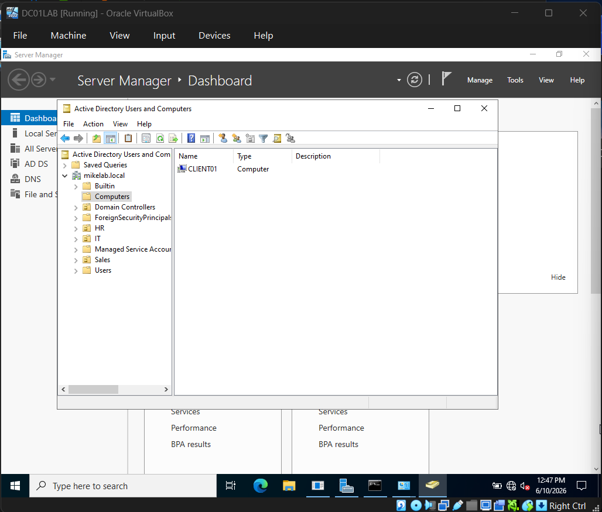
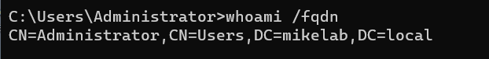
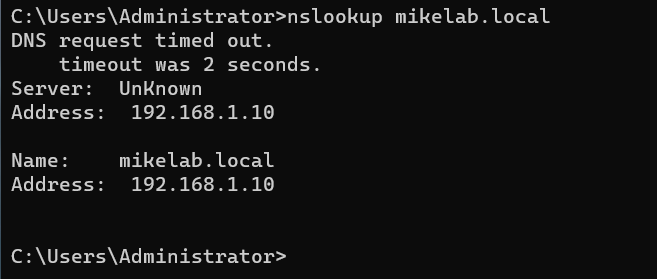
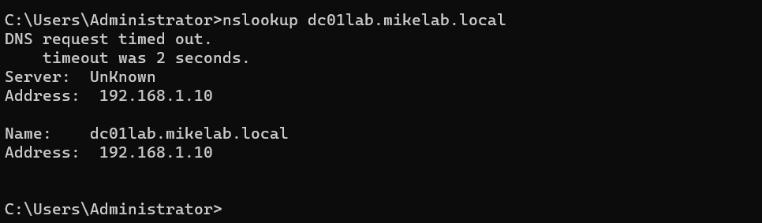
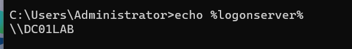

# Active Directory Home Lab

## Overview

This project demonstrates the deployment and administration of a Windows Active Directory environment using Windows Server 2022 and Windows 11 in Oracle VirtualBox.

The lab simulates a small business network where users, groups, organizational units, DNS, and domain authentication are managed through Active Directory Domain Services (AD DS).

---

## Technologies Used

* Windows Server 2022
* Windows 11
* Active Directory Domain Services (AD DS)
* DNS
* Group Policy
* Oracle VirtualBox

---

## Lab Objectives

* Deploy a Windows Server 2022 Domain Controller
* Configure Active Directory Domain Services
* Create Organizational Units (OUs)
* Create and manage user accounts
* Create and manage security groups
* Configure password policies
* Configure DNS
* Join a Windows 11 workstation to the domain
* Verify domain authentication

---

## Environment

### Domain Controller

* Hostname: DC01LAB
* IP Address: 192.168.1.10

### Domain

* mikelab.local

### Client Workstation

* Hostname: CLIENT01

---

## Key Accomplishments

* Installed and configured Active Directory Domain Services
* Created Organizational Units for IT, HR, and Sales departments
* Created and managed domain users and security groups
* Configured password policies through Group Policy
* Configured DNS for domain name resolution
* Joined a Windows 11 workstation to the Active Directory domain
* Verified successful domain authentication and connectivity

---

## Screenshots

Project screenshots are located in the Screenshots folder.

## Domain Created

---

## Organizational Units Created

---

## User Account Created

---

## IT Security Groups

---

## HR Security Group

---

## Sales Security Group

---

## Password Policy

---

## Domain Join Success

---

## Client Domain Login Verification

---

## Client Computer Object

---

## Domain Identity (FQDN)

---

## DNS Domain Resolution

---

## DNS Domain Controller Resolution

---

## Logon Server Verification

